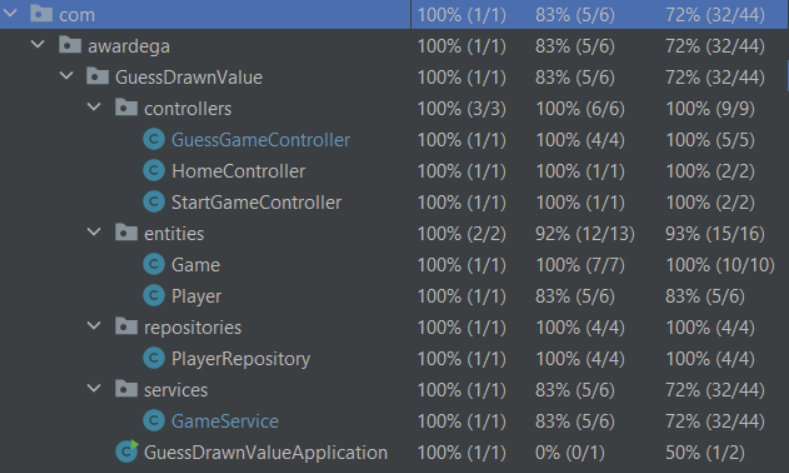
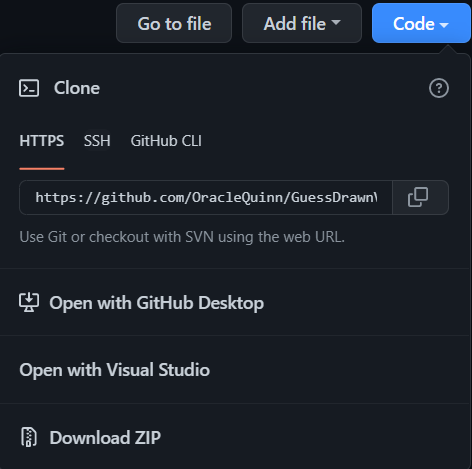
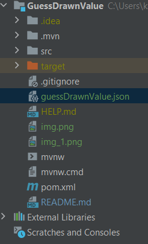
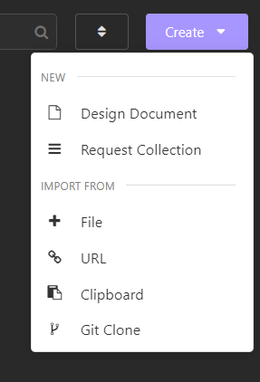
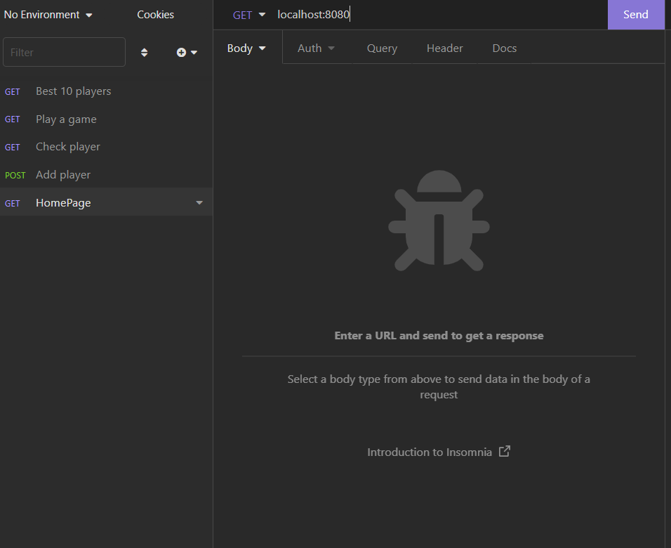

# demoGuessDrawnNumber
### Code coverage by tests:

### PREREQUISITES: 
1. IDE that allows you to open a file with the code or copy the repository - *Intelliji Idea* recommended.
2. Api Client - *Insomnia* recommended.
3. Java 11

### SETUP:
1. Download the zip file or clone the https repository using the git clone command.

2. Then open the file with the environment of your choice.
3. When the file loads, run it.
4. After the application starts, run Api Client.
5. Import into it the file provided with this repository named ***guessDrawnValue.json***.

6. While the application is running, select *Home Page* and click *SEND*.

